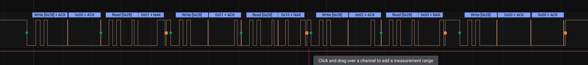

# Docs

The S Switch uses [I2C](https://en.wikipedia.org/wiki/I%C2%B2C) to communicate with
the monitor.

The monitor functions as the controller (or master) while the S Switch is a peripheral (or slave).
When a button is pressed on the S Switch, the interrupt pin is set high. Afterwards the monitor will
begin sending requests to the S Switch. When the 'command' (a button press) is finished, the interrupt pin
will be set low again.

Here's a capture of the 'exit' button being pressed:

## Protocol

The S Switch (at least my version) supports the following 'commands':
- exit
- select (wheel click)
- scroll down
- scroll up
- auto
- profile 1
- profile 2
- profile 3

The communication is as follows:
1. user clicks button
2. `INT` set high
3. monitor sends `0x00`
4. switch replies `0x01`
5. monitor sends `0x01`
6. switch replies with byte (value depends on command)
7. monitor sends `0x02`
8. switch replies with byte (value depends on command)
9. monitor sends `0x00`
10. monitor sends `0x00`
11. switch sets `INT` low.

### Commands

The first and second 'argument' values for each command are given in the following table:

| *Command* | *First byte* | *Second byte* |
|-----------|-------------:|--------------:|
| `EXIT`    | `0x10`       | `0x00`        |
| `SELECT`  | `0x40`       | `0x00`        |
| `UP`      | `0x00`       | `0x40`        |
| `DOWN`    | `0x00`       | `0x80`        |
| `AUTO`    | `0x08`       | `0x00`        |
| `P1`      | `0x01`       | `0x00`        |
| `P2`      | `0x02`       | `0x00`        |
| `P3`      | `0x04`       | `0x00`        |